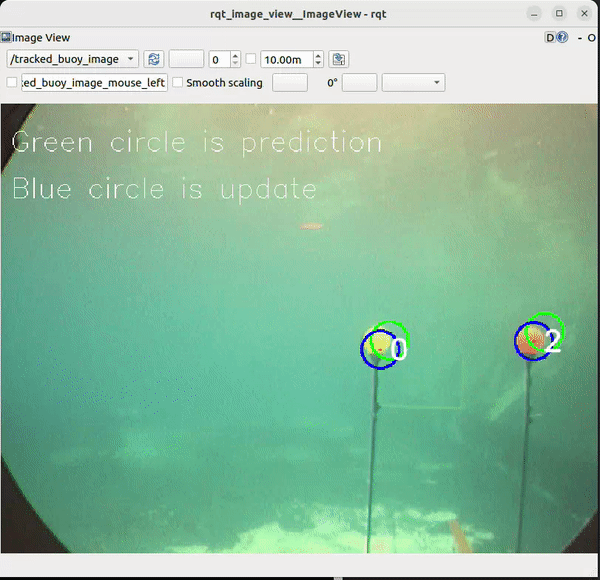

# Buoy Tracker

## Description
The goal of the project here is to track the buoys from the video

## Requirements
- ROS2 Humble
- numpy
- imutils
- Opencv-Python
- cv_bridge

## Data Preperation
Copy the contents in the resource folder [here](https://drive.google.com/drive/folders/1HG35-w2vO0vvufnM4jJCRVX_jEwbVhtK?usp=sharing) and copy them to resouce folder inside the buoy_tracker package. 

## Build instructions
Open a new terminal with ros sourced. 
1. mkdir -p tracker_ws/src
2. cd tracker_ws/src/
3. git clone https://github.com/saching13/buoy-tracker.git
4. cd ../..
5. rosdep install --from-paths src -y --ignore-src
6. colcon build --symlink-install

## Execution
open a new terminal with ros sourced
1. cd tracker_ws
2. source install/setup.bash
3. ros2 launch buoy_tracker buoy_tracker.launch.py 

## Buoy Tracker Node
Buoy tracker node detects the buoys from the video and tracks them accordingly.
As default config it detets them every alternative frame only and tracks the other time. 

Here are some of the configs.
- `video_file_path` -> path to the video
- `weights_file_path` -> Path to the weights used for GMM for detection of the buoy
- `detect_freq` -> used to determine once in how many frames are detected. While rest are tracked. Default is 4. 
- `max_decay_count` -> After how many predictions without detections does the tracker should discard the tracked object. This should be atleast twice the detect_freq

## Assumptions
- There will only 3 colored buoys
- Color information are not considered during the tracking to make the problem little more complicated to showcase the tracker and association algorithm.
- The detection algorithm is restructuede version of the algorithm in the reference mentioned below which is not optimized for speed at the moment. But there is space for improvement 

## References
For detection I am using the pre-trained Gaussian mixture model from [this](https://github.com/BrianBock/ENPM673_Project3) repository

## Additional improvements
Some of the improvements that I would like to add but left out for now due to being short on time. 
1. Include the radius in the tracker. 
2. Improve the tracking algorithm
3. Improve the lazy loops in the detection algorithm. 
4. Use the segmented images for training
5. Use a NN based segmentation algorithm instead of gauss mixture. 

## What was tried and didn't work. 
- Detection based on thresholding using RGB/BGR/HSV or LAB formats failed.

## Visualization
- In the implementation I am doing predict right after update. So that I can showcase where it is expecting the next position would be in the current image. 
- So In the image green circle shows where the algo is expecting the next position would be. While blue shows the updated position when the last detetion happened. which is 2 or 4 frames behind depending on the settings. 

